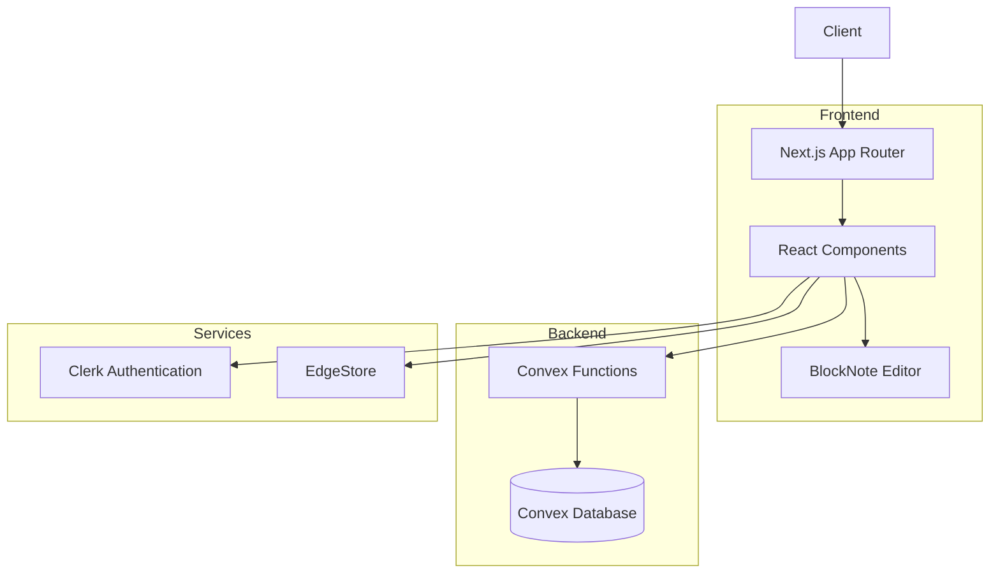
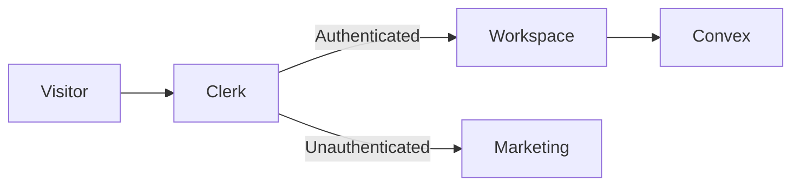
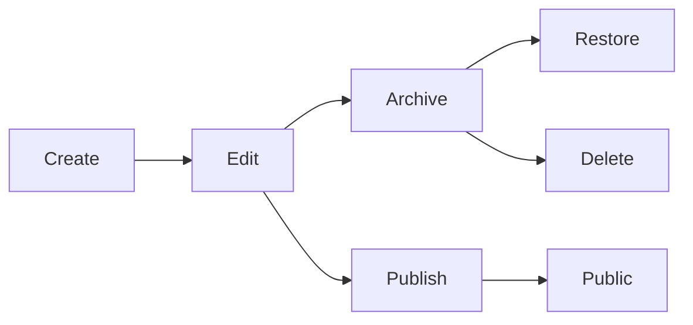

# Jotion

<p align="center">

  <h1 align="center">Jotion</h1>

  <p align="center">
    A modern full-stack document management platform inspired by the intuitive writing experience of Notion.
  </p>

  <p align="center">
    Built with <strong>Next.js 13</strong>, <strong>Convex</strong>, <strong>Clerk</strong>, <strong>BlockNote</strong>, <strong>EdgeStore</strong>, and <strong>TypeScript</strong>.
  </p>

  <p align="center">
    <a href="https://notes-app-red-kappa.vercel.app"><strong>🚀 Live Demo</strong></a>
  </p>
</p>

---

## Overview

Jotion is a full-stack document management application that enables users to create, organize, edit, and publish documents through a clean, intuitive interface inspired by modern knowledge management tools.

The application combines a serverless backend with a rich-text editing experience, hierarchical document organization, real-time synchronization, and secure authentication to deliver a responsive writing environment suitable for personal knowledge management.

Unlike traditional CRUD applications, Jotion demonstrates engineering concepts such as recursive document structures, authenticated serverless mutations, reusable component architecture, real-time data synchronization, and modern React development using the Next.js App Router.

---


# Features

### Authentication

- Secure authentication with Clerk
- Protected workspace
- Public document access
- Session management

### Document Management

- Create documents
- Update documents
- Archive documents
- Restore archived documents
- Permanently delete documents
- Nested document hierarchy
- Sidebar navigation

### Rich Text Editing

- BlockNote editor
- Rich formatting
- Headings
- Lists
- Paragraphs
- Live editing experience

### Publishing

- Publish documents publicly
- Shareable document URLs
- Read-only public pages

### Customization

- Cover images
- Emoji page icons
- Dark mode
- Light mode

### User Experience

- Responsive design
- Mobile navigation
- Loading states
- Toast notifications
- Search modal

---

# Technical Highlights

- Built using the Next.js 13 App Router
- Fully written in TypeScript
- Serverless backend powered by Convex
- Secure authentication with Clerk
- Recursive parent-child document model
- Real-time synchronization
- Component-driven architecture
- Custom React hooks
- Zustand for client-side state management
- EdgeStore integration for media uploads

---

# Architecture



---

# Authentication Flow



---

# Document Lifecycle



---

# Technology Stack

## Frontend

- Next.js 13
- React
- TypeScript
- Tailwind CSS
- Radix UI
- Zustand
- BlockNote

## Backend

- Convex

## Authentication

- Clerk

## File Storage

- EdgeStore

## Tooling

- ESLint
- PostCSS

---

# Project Structure

```
.
├── app/
│   ├── (marketing)
│   ├── (main)
│   ├── (public)
│   ├── api
│   └── layout.tsx
│
├── components/
│   ├── ui
│   ├── providers
│   ├── modals
│   └── ...
│
├── convex/
│   ├── documents.ts
│   ├── schema.ts
│   └── auth.config.js
│
├── hooks/
├── lib/
├── public/
└── middleware.ts
```

### Directory Overview

| Directory | Purpose |
|------------|----------|
| `app` | Application routing using the Next.js App Router |
| `components` | Reusable UI components |
| `convex` | Backend functions and database schema |
| `hooks` | Custom React hooks |
| `lib` | Shared utilities and helpers |
| `public` | Static assets |

---

# Database Overview

The application stores documents in a Convex collection using a hierarchical data model.

Each document contains metadata including:

- Title
- Content
- Owner
- Parent document
- Icon
- Cover image
- Published status
- Archived status

The parent-child relationship enables unlimited document nesting while keeping the schema straightforward and maintainable.

---

# Installation

Clone the repository.

```bash
git clone https://github.com/kishky101/Jotion.git
```

Navigate into the project.

```bash
cd Jotion
```

Install dependencies.

```bash
npm install
```

Create a local environment file.

```bash
cp .env.example .env.local
```

Start the development server.

```bash
npm run dev
```

---

# Environment Variables

Create a `.env.local` file and configure the required services.

```env
NEXT_PUBLIC_CLERK_PUBLISHABLE_KEY=

CLERK_SECRET_KEY=

NEXT_PUBLIC_CONVEX_URL=

EDGE_STORE_ACCESS_KEY=

EDGE_STORE_SECRET_KEY=
```

---

# Available Scripts

```bash
npm run dev
```

Runs the development server.

```bash
npm run build
```

Creates a production build.

```bash
npm run start
```

Starts the production server.

```bash
npm run lint
```

Runs ESLint.

---

# Engineering Decisions

### Next.js App Router

The application adopts the App Router to separate marketing pages, authenticated application routes, and public document pages while benefiting from React Server Components.

### Convex

Convex provides serverless backend functions with real-time synchronization, reducing backend complexity while maintaining end-to-end type safety.

### Recursive Document Structure

Documents are linked through parent-child relationships, allowing deeply nested pages without introducing unnecessary schema complexity.

### Clerk Authentication

Authentication is delegated to Clerk, enabling secure user management while keeping application logic focused on document operations.

### BlockNote

BlockNote was selected to provide a modern editing experience with a React-friendly API and extensible rich text capabilities.

---

# Performance Considerations

- Optimized routing with the App Router
- Reusable UI components
- Lightweight client-side state
- Real-time updates through Convex
- Responsive layouts
- Lazy loading where appropriate

---

# Security Considerations

- Authentication enforced before protected operations
- Backend ownership validation for document mutations
- Public access limited to explicitly published documents
- Secrets managed through environment variables

---

# Testing

Automated testing has not yet been implemented.

Recommended additions:

- React Testing Library
- Playwright
- GitHub Actions CI

---

# Deployment

The project is designed for deployment on Vercel with supporting cloud services.

Deployment requires:

- Convex project
- Clerk application
- EdgeStore configuration

---

# Future Improvements

- Collaborative editing
- Document version history
- Drag-and-drop page organization
- Keyboard shortcuts
- Document templates
- Markdown export
- PDF export
- Full-text search
- End-to-end testing
- CI/CD pipeline

---

# Contributing

Contributions are welcome.

If you'd like to improve the project, feel free to fork the repository, create a feature branch, and submit a pull request.

---

# License

This project is licensed under the MIT License.

---

# Acknowledgements

This project is built using several outstanding open-source technologies:

- Next.js
- Convex
- Clerk
- BlockNote
- Tailwind CSS
- Radix UI
- Lucide Icons
- Zustand
